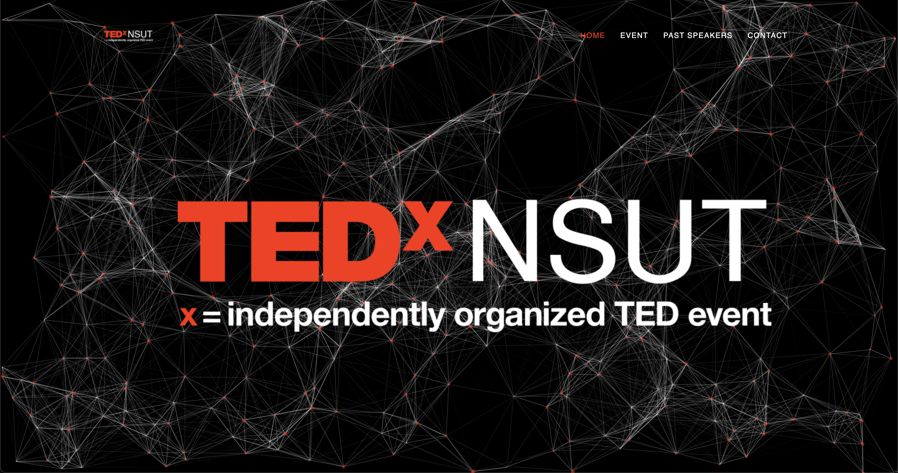

# TEDxNSUT_2021
TEDx is a program of local, self-organized events that bring people together to share a TED-like experience. At a TEDx event, TED Talks video and live speakers combine to spark deep discussion and connection. TEDx is a platform used to galvanize and bring a positive and impactful change in a person's belief. These local, self-organized events are branded TEDx, where x = independently organized TED event. 

The 'x' in TEDx signifies Independence from the shackles of shadow and brings sunshine. The 'x' is a variable which one can use to enrich culture and etiquette across individuals, society, and even countries. 

At TEDxNSUT, we are known for creating not only a conference but also a  Community during the process. We host one highly anticipated Conference annually. Our speakers spark conversations through their creative, innovative, and inspiring messages. Our TEDxTeam of student volunteers makes it their mission to find and disseminate the best ideas to the biggest possible audience.

